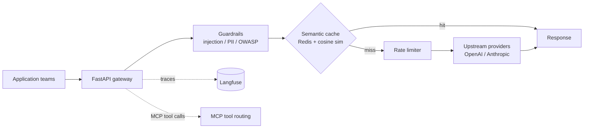

# LLM Gateway & Observability Platform — Technical Documentation

> **Living document.** This is the authoritative technical reference for the system. It **must** be updated in the same change set as any modification that alters the architecture, adds or removes a component, changes an interface or data contract, changes the caching/rate-limiting behavior, or changes the deployment topology. Record every such change in the [Revision history](#12-revision-history).

| | |
|---|---|
| **Status** | Draft — pre-implementation |
| **Owner** | Vijay Ananth Karunanithi |
| **Last updated** | 2026-07-07 |
| **Version** | 0.1.0 |

---

## 1. Overview

A gateway that sits between application teams and LLM providers, providing a single control point for cost, latency, safety, and observability. Every LLM call routes through the gateway, which applies semantic caching, rate limiting, guardrails, cost/latency tracking, and tracing. It is also MCP-aware, able to route agent tool calls in addition to raw completions.

The project's emphasis is production infrastructure: it runs locally under Docker Compose and deploys to Kubernetes (AWS EKS) via Helm and Terraform.

## 2. Goals and non-goals

**Goals**
- One proxy all teams call instead of provider SDKs directly.
- Reduce spend via semantic (similarity-based) caching, and quantify the reduction.
- Enforce rate limits and per-team/per-model cost visibility.
- Apply runtime guardrails (prompt-injection, PII/output filtering, OWASP LLM Top-10).
- Full tracing to Langfuse with sampled LLM-as-a-judge quality scoring.
- Real Kubernetes deployment with IaC.

**Non-goals**
- Training or hosting models (it proxies to existing providers).
- Being a general API gateway for non-LLM traffic.

## 3. System architecture

## 4. Component design

### 4.1 Proxy
- **FastAPI** async proxy; **httpx** for async upstream calls. Normalizes across providers behind one interface.

### 4.2 Semantic cache
- Incoming prompts are embedded; if cosine similarity to a cached entry exceeds `cache_similarity_threshold` (default 0.95), the cached response is served.
- Backed by **Redis**. Rationale: exact-match caching rarely hits on natural-language prompts; similarity-based caching is where meaningful savings arise.

### 4.3 Rate limiter
- Per-key request budgets (`rate_limit_per_minute`), counters in Redis.

### 4.4 Guardrails
- Inline on request and response: prompt-injection detection, PII/output filtering, and an OWASP-LLM-Top-10 checklist. Applied centrally so every team inherits it.

### 4.5 MCP routing
- The gateway can proxy and route MCP tool calls, allowing it to front an agent fleet rather than only completion endpoints.

## 5. Data and state

- **Redis:** cache entries (embedding + response + metadata: model, tokens, cost, timestamp) and rate-limit counters.
- **Langfuse (+ Postgres):** trace and metric persistence.
- No end-user PII is stored by the gateway beyond what transits in prompts; guardrails filter PII from logged payloads.

## 6. Interface contract

- `POST /v1/chat/completions` — provider-compatible completion proxy.
- `POST /v1/mcp/*` — MCP tool-call routing.
- `GET /metrics` — cost/latency/cache-hit metrics.
- `GET /health` — liveness/readiness.
- Contracts via Pydantic; breaking changes require a version bump and revision-history entry.

## 7. Evaluation and benchmarking

- **Benchmark script** measuring latency and cost with and without the semantic cache, over a representative request mix. Results recorded here.
- Sampled **LLM-as-a-judge** scoring on live traffic for quality-drift detection.

## 8. Security and compliance

- Secrets via environment / `.env`, never committed; in cluster via secret management.
- Guardrails are the primary runtime safety layer (injection, PII, output handling per OWASP LLM Top-10).
- Rate limiting protects against runaway spend and abuse.

## 9. Deployment and infrastructure

- **Local:** Docker Compose — gateway + Redis + Langfuse (+ Postgres) + mock LLM server.
- **Cloud:** AWS **EKS**, deployed via a **Helm** chart, infrastructure provisioned with **Terraform**.
- **CI/CD:** GitHub Actions — build image, lint, test, deploy.

## 10. Observability

- **Langfuse** — every call traced; dashboards for cost and latency by team and model.
- Alert thresholds documented alongside dashboards.

## 11. Build roadmap

1. FastAPI proxy + provider routing.
2. Redis semantic cache.
3. Rate limiter + cost/latency metrics.
4. Guardrails layer.
5. Langfuse tracing + LLM-judge sampling.
6. MCP tool-call routing.
7. Docker Compose stack.
8. EKS + Helm + Terraform + CI/CD.
9. Caching benchmark (latency + cost).

## 12. Revision history

| Date | Version | Change | Author |
|---|---|---|---|
| 2026-07-07 | 0.1.0 | Initial technical documentation (pre-implementation). | Vijay Ananth Karunanithi |
